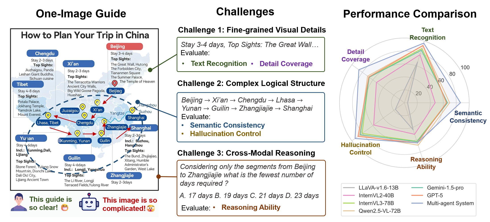
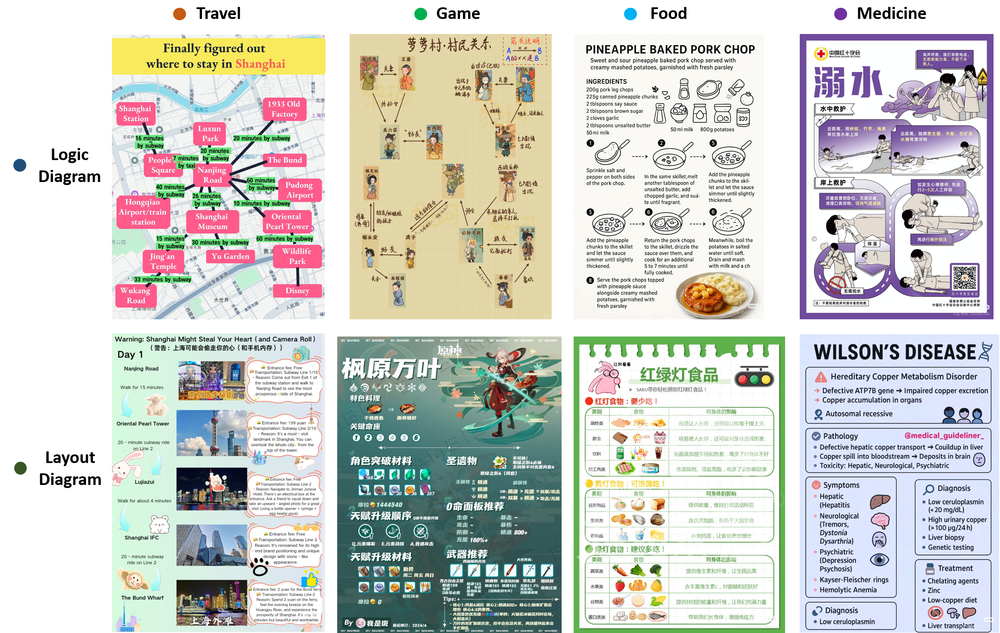
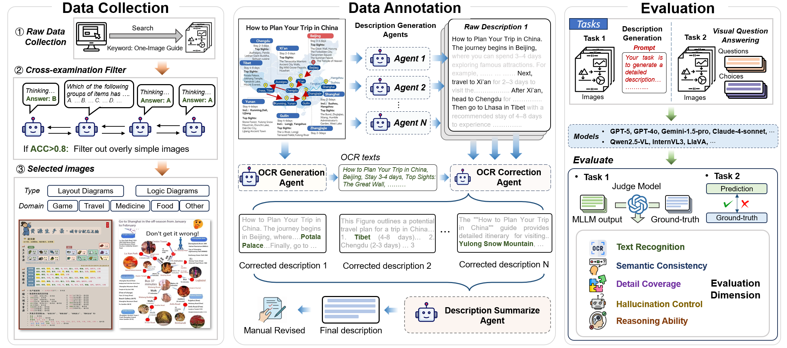

# OIG-Bench: A Multi-Agent Annotated Benchmark for Multimodal One-Image Guides Understanding

## Overview
Recent advances in Multimodal Large Language Models (MLLMs) have demonstrated impressive capabilities. However, evaluating their capacity for human-like understanding in **One‑Image Guides** remains insufficiently explored.  One‑Image Guides are a visual format combining text, imagery, and symbols to present reorganized and structured information for easier comprehension, which are specifically designed for human viewing and inherently embody the characteristics of human perception and understanding. Here, we present **OIG‑Bench**, a comprehensive benchmark focused on One-Image Guide understanding across diverse domains. To construct the benchmark efficiently, we developed a semi-automated annotation pipeline in which multiple intelligent agents collaborate to generate preliminary image descriptions, assisting humans in constructing image-text pairs. With OIG-Bench, we have conducted comprehensive evaluation of 29 state-of-the-art MLLMs, including both proprietary and open-source models. The results show that Qwen2.5-VL-72B performs the best among the evaluated models, with an overall accuracy of 77\%. Nevertheless, all models exhibit notable weaknesses in semantic understanding and logical reasoning, indicating that current MLLMs still struggle to accurately interpret complex visual-text relationships. In addition, we also demonstrate that the proposed multi-agent annotation system outperforms all MLLMs in image captioning, highlighting its potential as both a high-quality image description generator and a valuable tool for future dataset construction. 




## Dataset Examples
We collected 808 One-Image Guides across 4 domains. 



## Construction Pipeline

In this study, we introduced a multi-agent based annotation pipeline to generate image-text pairs. We collect One-Image Guide images from the Internet and filter them using a cross-examination process with multiple MLLMs, where one model poses questions and others answer. Images with accuracy above 0.8 are considered too simple and removed. Next, we annotate the images using a multi-agent system, followed by manual verification. In the evaluation stage, we assess MLLMs on two tasks, namely description generation and VQA, covering five key capabilities.



## 🔮 Evaluation Pipeline

### 1. Data Preparation

Download the data from [Here](https://drive.google.com/file/d/136u12VByVBimrlCXadHUdR3bBf30JhUJ/view?usp=drive_link) and place in ``./data/fig``

### 2. Run Evaluation

Due to variations in input and output handling across different MLLMs, we provide an example implementation using InternVL3_5. In addition, since the evaluation involves invoking the commercial model GPT‑4.1, users are required to replace the placeholder with their own GPT API token.

Examples:

```bash
cd ./evaluation
python InternVL/description_gen.py --model InternVL2_5_38B # For description and answer generation
python eval.py --eval_file InternVL/InternVL2_5-38B_description.xlsx  # For Evaluation

```

## Citation

If you find our work helpful for your research, please consider citing our work.

```
@article{xie2025oig,
  title={OIG-Bench: A Multi-Agent Annotated Benchmark for Multimodal One-Image Guides Understanding},
  author={Xie, Jiancong and Wang, Wenjin and Zhang, Zhuomeng and Liu, Zihan and Liu, Qi and Feng, Ke and Sun, Zixun and Yang, Yuedong},
  journal={arXiv preprint arXiv:2510.00069},
  year={2025}
}
```
